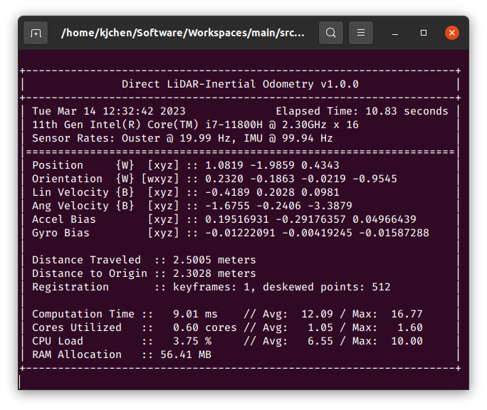
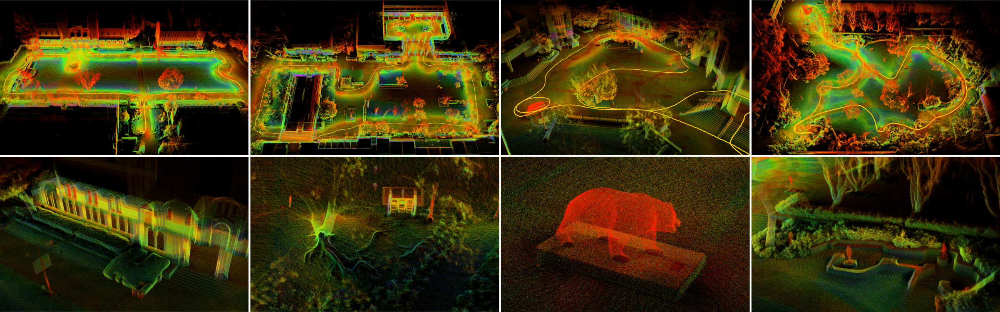
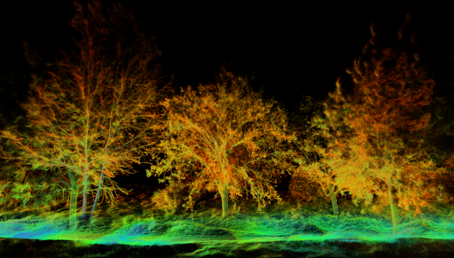

# Direct LiDAR-Inertial Odometry: Lightweight LIO with Continuous-Time Motion Correction

#### [[ IEEE ICRA ](https://ieeexplore.ieee.org/document/10160508)] [[ arXiv ](https://arxiv.org/abs/2203.03749)] [[ Video ](https://www.youtube.com/watch?v=4-oXjG8ow10)] [[ Presentation ](https://www.youtube.com/watch?v=Hmiw66KZ1tU)]

DLIO is a new lightweight LiDAR-inertial odometry algorithm with a novel coarse-to-fine approach in constructing continuous-time trajectories for precise motion correction. It features several algorithmic improvements over its predecessor, [DLO](https://github.com/vectr-ucla/direct_lidar_odometry), and was presented at the IEEE International Conference on Robotics and Automation (ICRA) in London, UK in 2023.

<br>
<p align='center'>
    
</p>

## Instructions

### Sensor Setup
DLIO has been extensively tested using a variety of sensor configurations and currently supports Ouster, Velodyne, and Hesai LiDARs. The point cloud should be of input type `sensor_msgs::PointCloud2` and the 6-axis IMU input type of `sensor_msgs::Imu`.

For best performance, extrinsic calibration between the LiDAR/IMU sensors and the robot's center-of-gravity should be inputted into `cfg/dlio.yaml`. If the exact values of these are unavailable, a rough LiDAR-to-IMU extrinsics can also be used (note however that performance will be degraded).

IMU intrinsics are also necessary for best performance, and there are several open-source calibration tools to get these values. These values should also go into `cfg/dlio.yaml`. In practice however, if you are just testing this work, using the default ideal values and performing the initial calibration procedure should be fine.

Also note that the LiDAR and IMU sensors _need_ to be properly time-synchronized, otherwise DLIO will not work. We recommend using a LiDAR with an integrated IMU (such as an Ouster) for simplicity of extrinsics and synchronization.

### Dependencies
The following has been verified to be compatible, although other configurations may work too:

- Ubuntu 22.04
- ROS Humble (`rclcpp`, `std_msgs`, `sensor_msgs`, `geometry_msgs`, `nav_msgs`, `pcl_ros`)
- C++ 14
- CMake >= `3.12.4`
- OpenMP >= `4.5`
- Point Cloud Library >= `1.10.0`
- Eigen >= `3.3.7`

```sh
sudo apt install libomp-dev libpcl-dev libeigen3-dev
```

DLIO currently supports `ROS 1` and `ROS 2`!

### Compiling
Compile using the [`catkin_tools`](https://catkin-tools.readthedocs.io/en/latest/) package via:

```sh
mkdir ~/ros2_ws && cd ~/ros2_ws && mkdir src && cd src
```
```sh
git clone https://github.com/vectr-ucla/direct_lidar_inertial_odometry -b feature/ros2
```
```sh
cd ~/ros2_ws
```
```sh
colcon build --symlink-install --packages-select direct_lidar_inertial_odometry
```

### Execution

<details>
<summary> After compiling, don't forget to source before ROS commands.</summary>

``` bash
source ~/ros2_ws/install/setup.bash
```
</details>

Execute via:

```sh
roslaunch direct_lidar_inertial_odometry dlio.launch \
  rviz:={true, false} \
  pointcloud_topic:=/robot/lidar \
  imu_topic:=/robot/imu
```

<details>
<summary> Example command: </summary>

``` bash
ros2 launch direct_lidar_inertial_odometry dlio.launch.py rviz:=true pointcloud_topic:=/lexus3/os_center/points imu_topic:=/lexus3/os_center/imu
```
</details>

Be sure to change the topic names to your corresponding topics. Alternatively, edit the launch file directly if desired. If successful, you should see the following output in your terminal:
<br>
<p align='center'>
    
</p>

### Services
To save DLIO's generated map into `.pcd` format, call the following service:

```sh
ros2 service call /save_pcd direct_lidar_inertial_odometry/srv/SavePCD "{'leaf_size': 0.2, 'save_path': '~/map'}"
```

### Test Data
For your convenience, we provide test data [here](https://drive.google.com/file/d/1Sp_Mph4rekXKY2euxYxv6SD6WIzB-wVU/view?usp=sharing) (1.2GB, 1m 13s, Ouster OS1-32) of an aggressive motion to test our motion correction scheme, and [here](https://drive.google.com/file/d/1HbmF5gTHxCAMqBkEd5PTxDNQvcI8tKXn/view?usp=sharing) (16.5GB, 4m 21s, Ouster OSDome) of a longer trajectory outside with lots of trees. Try these two datasets with both deskewing on and off!

<br>
<p align='center'>
    
</p>

## Citation
If you found this work useful, please cite our manuscript:

```bibtex
@article{chen2022dlio,
  title={Direct LiDAR-Inertial Odometry: Lightweight LIO with Continuous-Time Motion Correction},
  author={Chen, Kenny and Nemiroff, Ryan and Lopez, Brett T},
  journal={2023 IEEE International Conference on Robotics and Automation (ICRA)},
  year={2023},
  pages={3983-3989},
  doi={10.1109/ICRA48891.2023.10160508}
}
```

## Acknowledgements

We thank the authors of the [FastGICP](https://github.com/SMRT-AIST/fast_gicp) and [NanoFLANN](https://github.com/jlblancoc/nanoflann) open-source packages:

- Kenji Koide, Masashi Yokozuka, Shuji Oishi, and Atsuhiko Banno, “Voxelized GICP for Fast and Accurate 3D Point Cloud Registration,” in _IEEE International Conference on Robotics and Automation (ICRA)_, IEEE, 2021, pp. 11 054–11 059.
- Jose Luis Blanco and Pranjal Kumar Rai, “NanoFLANN: a C++ Header-Only Fork of FLANN, A Library for Nearest Neighbor (NN) with KD-Trees,” https://github.com/jlblancoc/nanoflann, 2014.

We would also like to thank Helene Levy and David Thorne for their help with data collection.

## License
This work is licensed under the terms of the MIT license.

<br>
<p align='center'>
    
</p>
<p align='center'>
    
</p>
